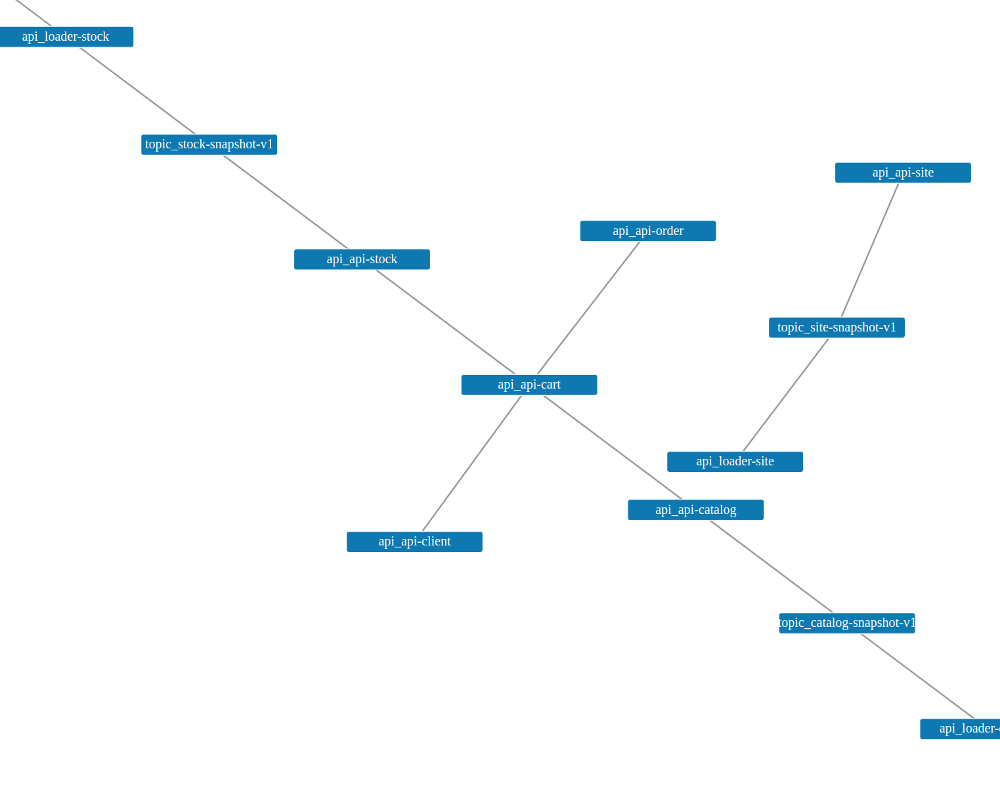
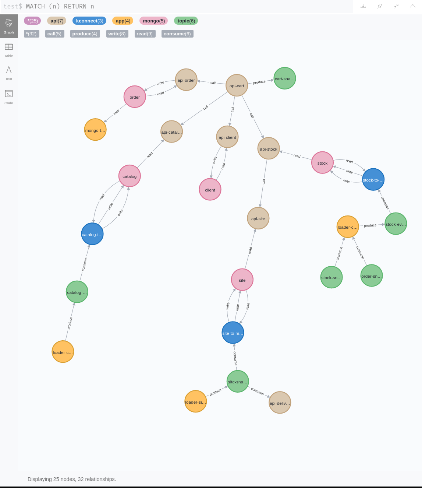

# create-microservice-map


Create a graph between all related elements, such as API, Kafka topic, by introspecting middleware configuration.

## Usage (docker)

Create a docker compose file (*docker-compose.yml*) like this following:

```yaml
version: "3.7"
services:
  create-microservice-map:
    image: "ianitrix/create-microservice-map:latest"
    hostname: create-microservice-map
    environment:
      - NEO4J_URL=http://neo4j:7474
      # Gravitee Configuration
      - APIM_URL=http://management_api:8083
      - APIM_USER=admin
      - APIM_PASS=admin
      # AKHQ Configuration
      - AKHQ_URL=http://akhq:8080
      - AKHQ_USER=admin
      - AKHQ_PASSWORD=admin
      - AKHQ_CLUSTER=docker-kafka-server
    restart: on-failure
    ports:
      - 8080:80
    networks:
      - net

  neo4j:
    image: "neo4j:4.1.1"
    hostname: neo4j
    restart: on-failure
    environment:
      - NEO4J_AUTH=none
    ports:
      - 7474:7474
      - 7687:7687
    networks:
      - net

networks:
  net:
    name: net    
```

Then open the following URL to display the graph JS [http://localhost:8080](http://localhost:8080)
or open this url [http://localhost:7474](http://localhost:7474) for the [Neo4J](https://neo4j.com) graph.


## Configuration

All configurations are done with environment variables.


* API Management [Gravitee](https://www.gravitee.io/)

| Configuration | Default value | Comment  |
| ------------- |:-------------:| -----:|
|  APIM_URL     |               | URL for Gravitee Management Api |
|  APIM_USER    |               | User login   |
|  APIM_PASS    |               | Password |

* Kafka IHM [Akhq](https://akhq.io/) (version 0.14 min)

| Configuration | Default value | Comment  |
| ------------- |:-------------:| -----:|
|  AKHQ_URL     |               | URL for AKHQ Api |
|  AKHQ_CLUSTER |               | Cluster name in AKHQ config |
|  AKHQ_USER    |               | User login   |
|  AKHQ_PASS    |               | Password |


## How it's work

The tool calls the REST API of the various tools (Gravitee, AkHQ, Elastic, ...) in order to retrieve the ACLs configuration.
Given this ACLs (read, write), a data graph is created inside __/var/www/html/graph.json__
A very simple HTML page running in *nginx* display the graph. 

## Test

If you want to test, there are several docker-compose files used to simulate an e-commerce SI.

First, clone the repo and start the docker network

```bash
# Clone the repo
git clone https://github.com/GuillaumeWaignier/create-microservice-map.git

# Start the docker netwok
cd test
docker-compose up -d
```

Then, create the Gravitee API Management

```bash
# Start Gravitee and all its dependencies (MongoDB, Elastic)
cd test/gravitee
docker-compose up -d
```

You can use the Gravitee UI to see the APIs and subscriptions at [http://localhost:8084](http://localhost:8084).
Login and password are *admin*/*admin*

You can create Kafka topic with
```bash
# Start AKHQ and all its dependencies (Zookeeper, Kafka)
cd test/kafka
docker-compose up -d
```

You can use the AKHQ to see the kafka topic and the associated ACLs at [http://localhost:8080](http://localhost:8080).

You can create the graph with

```bash
# Create the graph
docker-compose up -d
```

Then open the simple JS graph at [http://localhost:8081](http://localhost:8081).



Or open the neo4j graph at [http://localhost:7474](http://localhost:7474).


